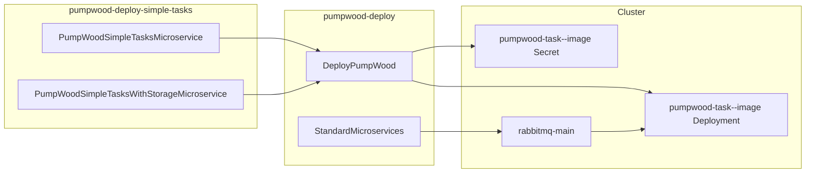

# pumpwood-deploy-simple-tasks

Satellite deploy package for **Pumpwood simple task** workers on
Kubernetes. It generates Secret and Deployment manifests for
RabbitMQ-backed task containers — then hands them to
[`pumpwood-deploy`](https://github.com/Murabei-OpenSource-Codes/pumpwood-deploy)
for apply.

Developed by [Murabei Data Science](https://murabei.com). BSD-3-Clause.

<p align="center" width="60%">
   <br>

  <a href="https://en.wikipedia.org/wiki/Cecropia">
    Pumpwood is a native Brazilian tree
  </a> with a symbiotic relation to ants (Murabei)
</p>

---

## What it deploys

Simple tasks are background workers that consume RabbitMQ messages.
They do not expose HTTP; no Service manifest is generated.

| Class | Manifest prefix | Kubernetes resources |
|-------|-----------------|----------------------|
| `PumpWoodSimpleTasksMicroservice` | `pumpwood_simple_tasks__{image}` | Secret + Deployment `pumpwood-task--{image}` |
| `PumpWoodSimpleTasksWithStorageMicroservice` | `pumpwood_simple_tasks_storage__{image}` | Same K8s names, plus storage env and volumes |

Add one microservice instance per task image. Each instance renders
two files: a per-task Secret (microservice credentials) and a
Deployment.

Use ``PumpWoodSimpleTasksMicroservice`` when the task does not read
project storage. Use ``PumpWoodSimpleTasksWithStorageMicroservice``
when the task must access cloud storage credentials from the cluster.

For a given ``image`` name, register **only one** of the two classes.
Both variants target the same Kubernetes Secret and Deployment names
(``pumpwood-task--{image}``).



---

## Prerequisites

This package does **not** stand alone. Before task pods can start, the
cluster should already provide:

| Resource | Required by | Provided by |
|----------|-------------|-------------|
| `dockercfg` image pull secret | All tasks | Cluster or `DeployPumpWood` setup |
| `general-secrets` | All tasks | `StandardMicroservices` in `pumpwood-deploy` |
| `rabbitmq-main-secrets` | All tasks | `StandardMicroservices` |
| `rabbitmq-main` | All tasks | `StandardMicroservices` |
| `storage` ConfigMap | Storage variant | `StandardMicroservices` |
| `gcp--storage-key` | Storage variant | `DeployPumpWood` storage config |
| `azure--storage-key` | Storage variant (Azure) | `DeployPumpWood` storage config |
| `aws--storage-key` | Storage variant (AWS) | `DeployPumpWood` storage config |

Storage bucket name and type are read from the cluster ``storage``
ConfigMap at runtime — they are **not** passed to
``PumpWoodSimpleTasksWithStorageMicroservice``.

---

## Installation

```bash
pip install pumpwood-deploy-simple-tasks
```

Requires `pumpwood-deploy`.

---

## Quick start

```python
import os
import simplejson as json
from dotenv import load_dotenv
from pumpwood_deploy.deploy import DeployPumpWood
from pumpwood_deploy_simple_tasks import (
    PumpWoodSimpleTasksMicroservice,
    PumpWoodSimpleTasksWithStorageMicroservice)

with open("secrets/production.json", "r") as file:
    secrets = json.loads(file.read())
load_dotenv()

deploy = DeployPumpWood(
    model_user_password=secrets["microservices--model"],
    rabbitmq_secret=secrets["rabbitmq_secret"],
    hash_salt=secrets["hash_salt"],
    k8_provider="aws",
    k8_deploy_args={
        "region": "us-east-1",
        "cluster_name": "my-cluster",
    },
    k8_namespace="pumpwood",
)

deploy.add_microservice(
    PumpWoodSimpleTasksMicroservice(
        image="my-simple-task",
        version=os.getenv("MY_SIMPLE_TASK_VERSION"),
        microservice_username="microservice--my-task",
        microservice_password=secrets["microservice--my-task"],
        repository="my-registry.example.com",
        replicas=1,
    ))

deploy.add_microservice(
    PumpWoodSimpleTasksWithStorageMicroservice(
        image="my-storage-task",
        version=os.getenv("MY_STORAGE_TASK_VERSION"),
        microservice_username="microservice--my-storage-task",
        microservice_password=secrets["microservice--my-storage-task"],
        repository="my-registry.example.com",
    ))

deploy.create_deploy_files()
deploy.deploy_microservices()
```

### Environment variables

```bash
MY_SIMPLE_TASK_VERSION=1.0.0
MY_STORAGE_TASK_VERSION=1.0.0
```

If the rendered manifest matches what is already on the cluster,
``kubectl apply`` produces no changes — safe for rolling image updates.

---

## Configuration reference

Both classes accept the same parameters.

### Required

| Parameter | Description |
|-----------|-------------|
| `image` | Docker image name (also used in K8s resource names) |
| `version` | Container image tag |
| `microservice_username` | Service username stored in the task Secret |
| `microservice_password` | Plain-text password encoded into the task Secret |

### Optional

| Parameter | Default | Description |
|-----------|---------|-------------|
| `repository` | GCR default | Docker registry |
| `replicas` | `1` | Number of pod replicas |
| `requests_memory` | `20Mi` | Memory request |
| `requests_cpu` | `1m` | CPU request |
| `limits_memory` | `512Mi` | Memory limit |
| `limits_cpu` | `500m` | CPU limit |

### Injected environment (Deployment template)

All tasks receive:

| Variable | Source |
|----------|--------|
| `HASH_SALT` | `general-secrets` |
| `PUMPWOOD_COMMUNICATION__CRYPTO_FERNET_KEY` | `general-secrets` |
| `RABBITMQ_HOST` | Fixed: `rabbitmq-main` |
| `RABBITMQ_PASSWORD` | `rabbitmq-main-secrets` |
| `MICROSERVICE_USERNAME` | Per-task Secret |
| `MICROSERVICE_PASSWORD` | Per-task Secret |

The storage variant additionally receives ``STORAGE_BUCKET_NAME``,
``STORAGE_TYPE``, ``GOOGLE_APPLICATION_CREDENTIALS``, and optional
Azure/AWS storage credentials from cluster secrets.

---

## Related packages

| Package | Role |
|---------|------|
| [`pumpwood-deploy`](https://github.com/Murabei-OpenSource-Codes/pumpwood-deploy) | Orchestrator, Kong, RabbitMQ |
| [`pumpwood-deploy-datalake`](https://github.com/Murabei-OpenSource-Codes/pumpwood-deploy-datalake) | Core datalake app and dataloader worker |
| [`pumpwood-deploy-auth`](https://github.com/Murabei-OpenSource-Codes/pumpwood-deploy-auth) | Authorization microservice |

Full platform documentation:
[Murabei Open Source — pumpwood-deploy](https://murabei-opensource-codes.github.io/pumpwood-deploy/).

---

## Development

```bash
pip install -e ../pumpwood-deploy
pip install -e .

PYTHONPATH="src:../pumpwood-deploy/src" python3 -c "
from pumpwood_deploy_simple_tasks import PumpWoodSimpleTasksMicroservice
PumpWoodSimpleTasksMicroservice(
    'my-task', '1.0.0', 'microservice--my-task', 'secret'
).create_deployment_file()
"

ruff check src/
```

---

## License

BSD-3-Clause — see [LICENSE](LICENSE).
